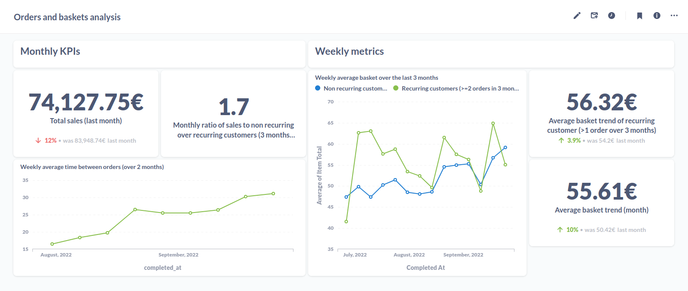
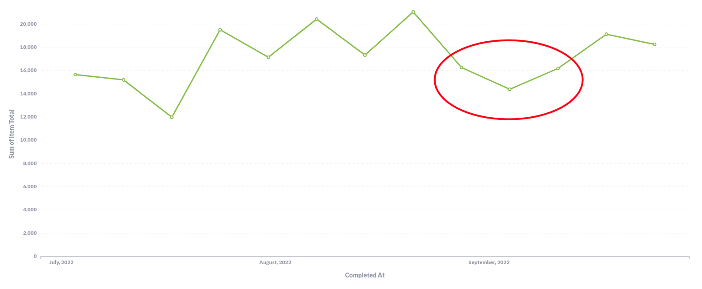
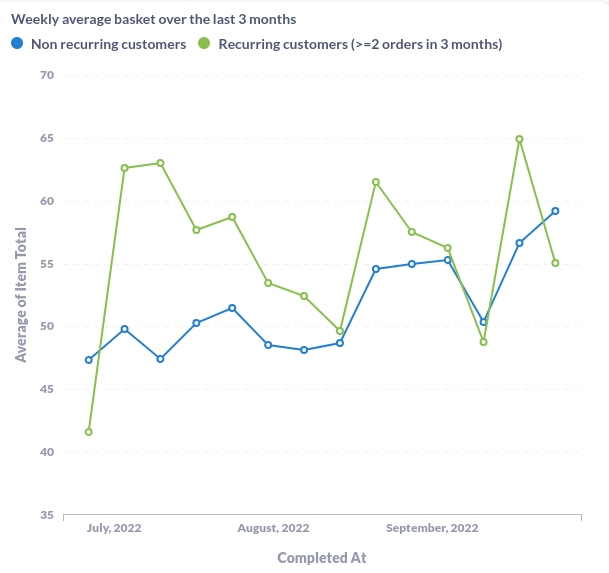
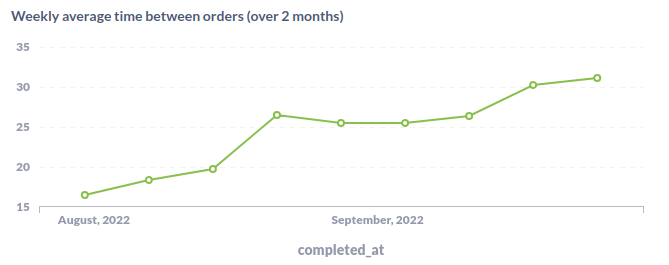

# Data analysis report

After ingesting the data, we use Metabase to go in depth in the data. With this tool we created a simple sales dashboard containing generic sales KPIs and average basket metrics aswell as average time between orders to have a complete overview of sales over the last months.

Dashboard:

If everything is setup and running with the default configuration, you can find this dashboard [here](http://localhost:3000/dashboard/2-orders-and-baskets-analysis) running locally.

After working with this dataset, here is the relevant information contained in the data (only 3 months).

In the rest of the document, we will refer to customers who have made 2 orders or more in the last 3 months as repeat customers. 

## General trends

Overall, there is a sales increase between July and September (from ~15.500€/week to ~17.000€/week).

[Weekly sales (€) from July to September](http://localhost:3000/question/21-weekly-sales)

Yet, there is a significant drop in sales, average basket and orders around 
weeks 36 and 37. This dive is significant enough to justify investigation. Every metric rebounds after this event which limits its impact on overall sales.

The ratio of sales made to one time customers over sales made to repeat customer is 1.73. It shows us that more than 60% of sales (in September) are made to customers who haven't ordered in the past 3 months. With more data it would be interesting to know if these customers are new customers or if they rarely buy from us. We might have a pool of soon to be regular customers only waiting for an opportunity to order more often.

## Average basket

[Weekly average basket (€) from July to September](http://localhost:3000/question/21-weekly-sales)

On this data, repeat customers spend slightly more money per order than one time customers but this difference diminishes until it disappears in September.

Average basket for both groups of customers drops during the 15th of July to 15th of August period (vacations period in France). Then, early September, we notice a surge in average baskets value (+~11% for non-repeat customer, +25% for repeat customer). Without more context, it is complicated to comment the reasons for such changes.

## Time between orders

[Weekly average time between orders from August to September](http://localhost:3000/question/21-weekly-sales)
The average time between orders is a temporal data which would benefit from a more significant data history (window of analysis +2 months).
Repeat customers order every ~26 days (stable data in late August early September).

Around mid-September, time between orders increases by around 20%. It is most likely a consequence of sales drop at this period. It would be interesting to check the same data in October to this if the value returns to its stable state.

Average time between orders not enough data, need more history
To go further, analyze number of new customers but need more history

## Outlier
| id     | user_id | completed_at            | item_total | shipment_total |
| ------ | ------- | ----------------------- | ---------- | -------------- |
| 247792 | 4493    | 2022-07-01 09:42:00.000 | 0.0        | 0.0            |

For this order both item_total and shipment_total are equal to zero. Is this an anomaly or a discount? 

# What we learnt

All metrics and KPI fluctuate over the summer. Two main events seem to affect sales, the summer break (lowers average basket) and an unknown event in September that drastically lowered all metrics.

Overall, sales are up over the summer but we must be careful about customers increasing time between their orders in spetember from around 26 days to over 31 days. Another point of attention for future months is the overall decrease in average basket for repeat customers.

## Further analysis

This analysis is very limited as we can't correlate these sales data with stocks, discounts, availability of the website or any other event. We can only follow seasonal trends.

With more data, we could have computed more insights such as:
- Number of new customers
- Number of new customers/number of repeat customers
- Cohort analysis
- Churn rate